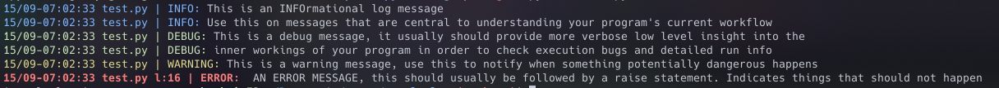

# pycolorlogs

##  Intoduction

The name _pycolorlogs_ is a wordplay between the words **py**thon, **color**s and **logs**

**py**~~thon~~**color**~~s~~**logs**


**pycolorlogs** Is a simple module to improve standard python logging capabilities by providing colored logging outputs, some context information and improved formatting. Future updates are in development to enable automatically redirection of logging to files similar to __tee__ command in linux and some other functionalities.
Feel free to provide suggestions/comments here on github by opening an issue

------------------------

## Implementation

This package enables 256-bit colored output in python logging package by instantiating an alternate *logging.StreamHandler* object which formats logs with colors and level descriptors, like on the screenshot below:



Under the hood, **pycolorlogs** just wraps around python's built in logging package and expose some useful methods and constants.

------------

## Quick Use
Using **pycolorlogs** is very simple, First you should install the package with the command:
```shell
python3 -m pip --user install pycolorlogs
```
>Note: if you are using venv, pipenv or a similar virtual environment tool you may ignore the __--user__ flag

to begin logging away just import the ```init_logs()``` method, the lowest severity which you plan to display and finally the logging methods such as ```debug()``` and ```warn()```
``` python
from pycolorlogs import init_logs, INFO, info, debug
```
To use **pycolorlogs** simply initialize the package with the chosen severity level, like this:
```python
init_logs(DEBUG)
```

and start logging away:
```python 3
# Import the module
from pycolorlogs import init_logs, DEBUG, debug, error, info

# Initialize the handler
init_logs(DEBUG)

# Log away !
info('Starting program...')
a: int = 5
b: int = 3
result: int = a+b
debug(f'The result is {result}')
try:
    denominator = 0
    division = 100/denominator
except:
    error('Can\'t divide by 0 !!')
finally:
    debug(f'The result is: {division}')
info('Done !')
```

this outputs:

<body style="font-size:10pt;color:#c3c7d1;background-color:#1a1e21;">
<br></br>
<span style="color:#7cb7ff;">15/09-07:54:55 example.py | INFO:</span>
<span style="color:#c3c7d1;"> Starting program...</span>
<br></br>
<span style="color:#cae7b9;">15/09-07:54:55 example.py | DEBUG:</span>
<span style="color:#c3c7d1;"> The result is 8</span>
<br></br>
<span style="font-weight:bold;color:#f67e7d;">15/09-07:54:55 example.py l:17 | ERROR:</span>
<span style="color:#c3c7d1;"> Can't divide by 0 !!</span>
<br>
</br>
</body>

-------------------

## In Depth Explanation

The first imported element, __init_logs__ is the function responsible for initializing the Handler and replacing it with logging package's default instance. You should provide a logging level integer as a parameter to this method. This will tell the lowest level of logging that will be printed by your program.
the options are, in verbosity order from lower to higher level:

- **CRITICAL** or **FATAL**    
- **ERROR**
- **WARNING** or **WARN**   
- **INFO**
- **DEBUG**

These are actually defined as constant integers on the logging module, in **pycolorlogs** these values are just exported to the user in order to avoid the need to import logging module as well as **pycolorlogs**

After importing the ```init_logs()``` method, the least severe chosen logging level is imported, **INFO** on this example. This means that every log message whose level is lower than INFO will not be printed, while more severe messages, on the other hand, will be shown normally. If **INFO** is given as an argument to ```init_logs()``` it means that only **DEBUG** level messages will be hidden, while **WARNING**, **ERROR** and **CRITICAL** level information will keep being shown.

Lastly the appropriate logger functions are imported. These are used to log a message of the homonimous severity. ```info()``` method outputs **INFO** level messages, while ```debug()```will print **DEBUG** information and so on. 
